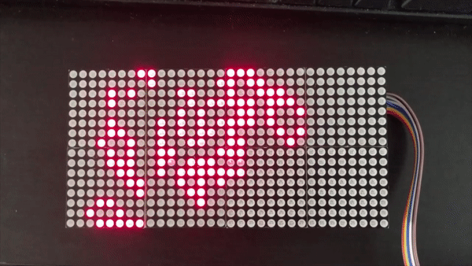

# Arduino Game of Life

### Introduction

This is a small project to test the 32x16 led modules found on internet

From Wikipedia: The Game of Life, also known simply as Life, is a cellular automaton devised by the British mathematician John Horton Conway in 1970. It is a zero-player game, meaning that its evolution is determined by its initial state, requiring no further input. One interacts with the Game of Life by creating an initial configuration and observing how it evolves. It is Turing complete and can simulate a universal constructor or any other Turing machine

This sketch stores 2 worlds in memory, this way, we can determine if the world is repeating itself leading to a black LCD. When the sketch determines the world has ended, it resets itself. 

### Software

This sketch uses the `myMATRIX.h` library. It could be found using the library manager. 

### Hardware

- Arduino Uno
- Unknown 32x16 Led matrix

### Setup

Just wire the arduino pins to the led matrix as follows:

```
#define RowA_Pin 2
#define RowB_Pin 3
#define RowC_Pin 4
#define RowD_Pin 5
#define OE_Pin 6
#define Red_Pin 7
#define Green_Pin 8
#define CLK_Pin 9
#define STB_Pin 10
```

### Example



